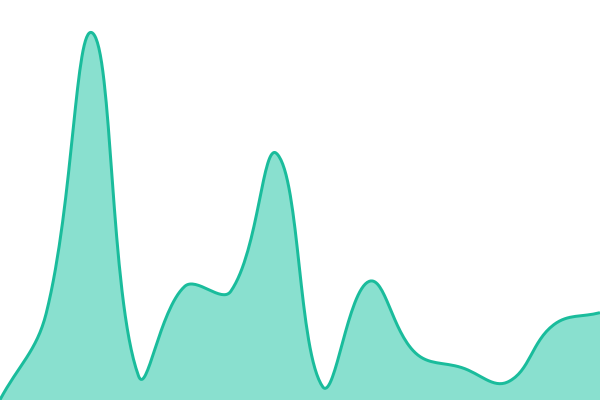
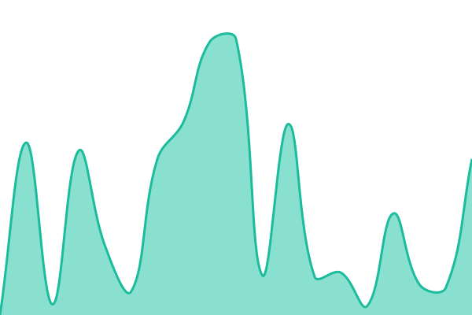

# [📈 Live Status](https://drsumaiya.github.io/drsumaiya.com-upptime): <!--live status--> **🟩 All systems operational**

This repository contains the open-source uptime monitor and status page for [drsumaiya](https://drsumaiya.github.io/drsumaiya.com-upptime), powered by [Upptime](https://github.com/upptime/upptime).

With [Upptime](https://upptime.js.org), you can get your own unlimited and free uptime monitor and status page, powered entirely by a GitHub repository. We use [Issues](https://github.com/drsumaiya/drsumaiya.com-upptime/issues) as incident reports, [Actions](https://github.com/drsumaiya/drsumaiya.com-upptime/actions) as uptime monitors, and [Pages](https://drsumaiya.github.io/drsumaiya.com-upptime) for the status page.

<!--start: status pages-->
<!-- This summary is generated by Upptime (https://github.com/upptime/upptime) -->
<!-- Do not edit this manually, your changes will be overwritten -->
<!-- prettier-ignore -->
| URL | Status | History | Response Time | Uptime |
| --- | ------ | ------- | ------------- | ------ |
|  [DrSumaiya.com](https://DrSumaiya.com) | 🟩 Up | [dr-sumaiya-com.yml](https://github.com/drsumaiya/drsumaiya.com-upptime/commits/HEAD/history/dr-sumaiya-com.yml) | 

 588ms
     
 | 

<a href="https://status.drsumaiya.com/history/dr-sumaiya-com">96.56%</a>
    

|  [IQS](https://iqs.org.in) | 🟩 Up | [iqs.yml](https://github.com/drsumaiya/drsumaiya.com-upptime/commits/HEAD/history/iqs.yml) | 

 1017ms
     
 | 

<a href="https://status.drsumaiya.com/history/iqs">97.03%</a>
    

<!--end: status pages-->

[**Visit our status website →**](https://drsumaiya.github.io/drsumaiya.com-upptime)

## 📄 License

- Powered by: [Upptime](https://github.com/upptime/upptime)
- Code: [MIT](./LICENSE) © [Anand Chowdhary](https://anandchowdhary.com)
- Data in the `./history` directory: [Open Database License](https://opendatacommons.org/licenses/odbl/1-0/)
