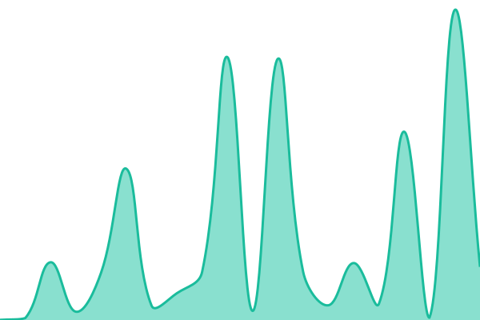
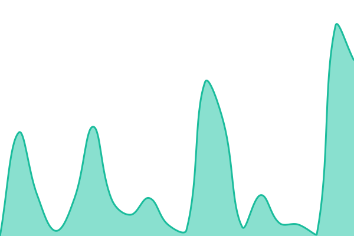
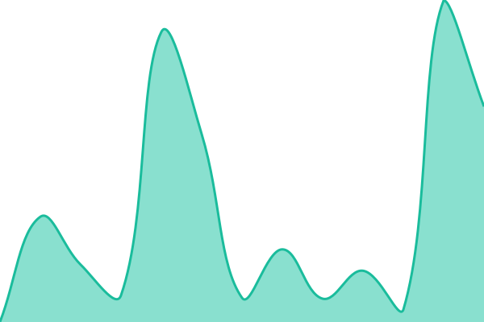
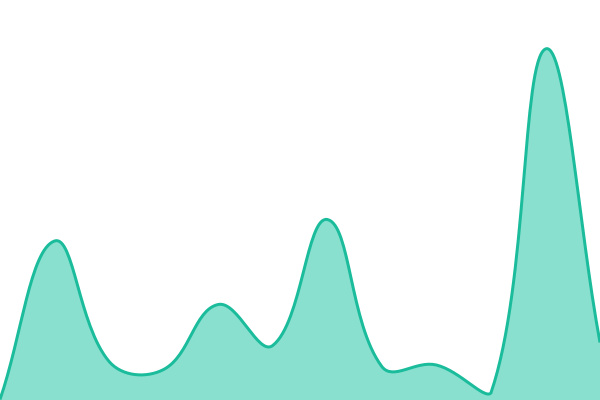
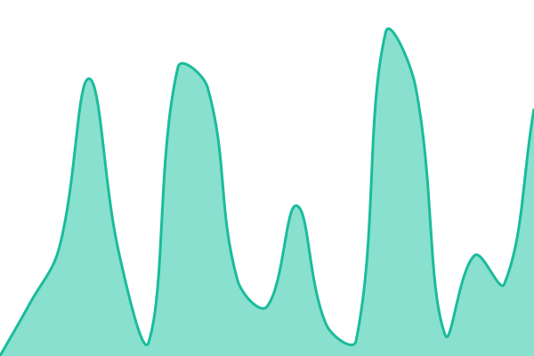
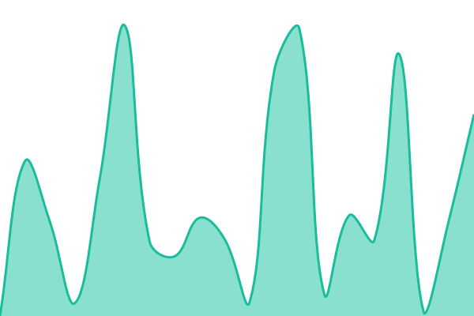
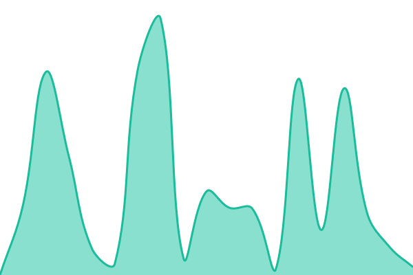
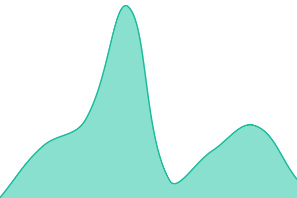
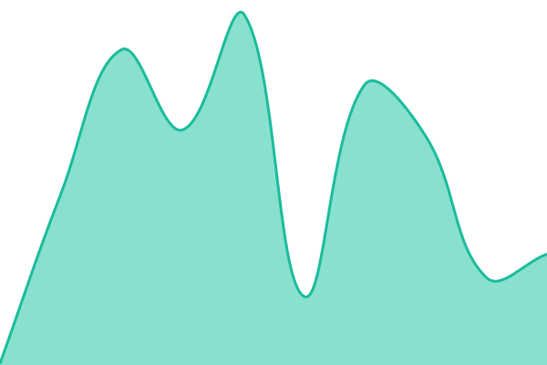
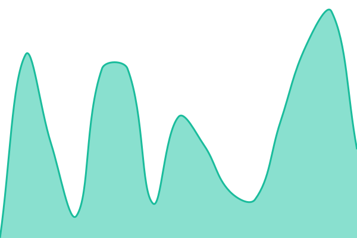

# [📈 Live Status](https://drsumaiya.github.io/drsumaiya.com-upptime): <!--live status--> **🟩 All systems operational**

This repository contains the uptime monitoring system, Core Web Vitals tracking pipeline, and public status page for [DrSumaiya.com](https://drsumaiya.com).

[](https://github.com/drsumaiya/drsumaiya.com-upptime/actions/workflows/uptime.yml)
[](https://github.com/drsumaiya/drsumaiya.com-upptime/actions/workflows/response-time.yml)
[](https://github.com/drsumaiya/drsumaiya.com-upptime/actions/workflows/graphs.yml)
[](https://github.com/drsumaiya/drsumaiya.com-upptime/actions/workflows/site.yml)
[](https://github.com/drsumaiya/drsumaiya.com-upptime/actions/workflows/pagespeed.yml)
[](https://github.com/drsumaiya/drsumaiya.com-upptime/actions/workflows/seo-health.yml)
[](https://github.com/drsumaiya/drsumaiya.com-upptime/actions/workflows/email-dns-health.yml)
[](https://github.com/drsumaiya/drsumaiya.com-upptime/actions/workflows/forms-health.yml)
[](https://github.com/drsumaiya/drsumaiya.com-upptime/actions/workflows/ssl-health.yml)
[](https://github.com/drsumaiya/drsumaiya.com-upptime/actions/workflows/summary.yml)

A 100% serverless, zero-maintenance uptime monitor and status page powered entirely by GitHub infrastructure:

- **[Issues](https://github.com/drsumaiya/drsumaiya.com-upptime/issues)** serve as transparent incident reports and degradation post-mortems.
- **[GitHub Actions](https://github.com/drsumaiya/drsumaiya.com-upptime/actions)** execute health checks, latency probes, and Lighthouse / PageSpeed audits.
- **[GitHub Pages](https://status.drsumaiya.com)** hosts the responsive status website with interactive historical trend charts.

<!--start: status pages-->
<!-- This summary is generated by Upptime (https://github.com/upptime/upptime) -->
<!-- Do not edit this manually, your changes will be overwritten -->
<!-- prettier-ignore -->
| URL | Status | History | Response Time | Uptime |
| --- | ------ | ------- | ------------- | ------ |
|  [DrSumaiya.com](https://DrSumaiya.com) | 🟩 Up | [dr-sumaiya-com.yml](https://github.com/drsumaiya/drsumaiya.com-upptime/commits/HEAD/history/dr-sumaiya-com.yml) | <details><summary> 334ms</summary><br><a href="https://status.drsumaiya.com/history/dr-sumaiya-com"></a><br><a href="https://status.drsumaiya.com/history/dr-sumaiya-com"></a><br><a href="https://status.drsumaiya.com/history/dr-sumaiya-com"></a><br><a href="https://status.drsumaiya.com/history/dr-sumaiya-com"></a><br><a href="https://status.drsumaiya.com/history/dr-sumaiya-com"></a></details> | <details><summary><a href="https://status.drsumaiya.com/history/dr-sumaiya-com">62.70%</a></summary><a href="https://status.drsumaiya.com/history/dr-sumaiya-com"></a><br><a href="https://status.drsumaiya.com/history/dr-sumaiya-com"></a><br><a href="https://status.drsumaiya.com/history/dr-sumaiya-com"></a><br><a href="https://status.drsumaiya.com/history/dr-sumaiya-com"></a><br><a href="https://status.drsumaiya.com/history/dr-sumaiya-com"></a></details>
|  [DrSumaiya - Inquiry Form](https://drsumaiya.com/inquiry-form/) | 🟩 Up | [dr-sumaiya-inquiry-form.yml](https://github.com/drsumaiya/drsumaiya.com-upptime/commits/HEAD/history/dr-sumaiya-inquiry-form.yml) | <details><summary> 720ms</summary><br><a href="https://status.drsumaiya.com/history/dr-sumaiya-inquiry-form"></a><br><a href="https://status.drsumaiya.com/history/dr-sumaiya-inquiry-form"></a><br><a href="https://status.drsumaiya.com/history/dr-sumaiya-inquiry-form"></a><br><a href="https://status.drsumaiya.com/history/dr-sumaiya-inquiry-form"></a><br><a href="https://status.drsumaiya.com/history/dr-sumaiya-inquiry-form"></a></details> | <details><summary><a href="https://status.drsumaiya.com/history/dr-sumaiya-inquiry-form">62.76%</a></summary><a href="https://status.drsumaiya.com/history/dr-sumaiya-inquiry-form"></a><br><a href="https://status.drsumaiya.com/history/dr-sumaiya-inquiry-form"></a><br><a href="https://status.drsumaiya.com/history/dr-sumaiya-inquiry-form"></a><br><a href="https://status.drsumaiya.com/history/dr-sumaiya-inquiry-form"></a><br><a href="https://status.drsumaiya.com/history/dr-sumaiya-inquiry-form"></a></details>
|  [DrSumaiya - Booking Form](https://drsumaiya.com/form/) | 🟩 Up | [dr-sumaiya-booking-form.yml](https://github.com/drsumaiya/drsumaiya.com-upptime/commits/HEAD/history/dr-sumaiya-booking-form.yml) | <details><summary> 649ms</summary><br><a href="https://status.drsumaiya.com/history/dr-sumaiya-booking-form"></a><br><a href="https://status.drsumaiya.com/history/dr-sumaiya-booking-form"></a><br><a href="https://status.drsumaiya.com/history/dr-sumaiya-booking-form"></a><br><a href="https://status.drsumaiya.com/history/dr-sumaiya-booking-form"></a><br><a href="https://status.drsumaiya.com/history/dr-sumaiya-booking-form"></a></details> | <details><summary><a href="https://status.drsumaiya.com/history/dr-sumaiya-booking-form">62.81%</a></summary><a href="https://status.drsumaiya.com/history/dr-sumaiya-booking-form"></a><br><a href="https://status.drsumaiya.com/history/dr-sumaiya-booking-form"></a><br><a href="https://status.drsumaiya.com/history/dr-sumaiya-booking-form"></a><br><a href="https://status.drsumaiya.com/history/dr-sumaiya-booking-form"></a><br><a href="https://status.drsumaiya.com/history/dr-sumaiya-booking-form"></a></details>
|  [DrSumaiya - Success Stories Post](https://drsumaiya.com/post/transforming-health-and-lives-real-success-stories-from-dr-sumaiyas-nutricare-clinic/) | 🟩 Up | [dr-sumaiya-success-stories-post.yml](https://github.com/drsumaiya/drsumaiya.com-upptime/commits/HEAD/history/dr-sumaiya-success-stories-post.yml) | <details><summary> 726ms</summary><br><a href="https://status.drsumaiya.com/history/dr-sumaiya-success-stories-post"></a><br><a href="https://status.drsumaiya.com/history/dr-sumaiya-success-stories-post"></a><br><a href="https://status.drsumaiya.com/history/dr-sumaiya-success-stories-post"></a><br><a href="https://status.drsumaiya.com/history/dr-sumaiya-success-stories-post"></a><br><a href="https://status.drsumaiya.com/history/dr-sumaiya-success-stories-post"></a></details> | <details><summary><a href="https://status.drsumaiya.com/history/dr-sumaiya-success-stories-post">62.87%</a></summary><a href="https://status.drsumaiya.com/history/dr-sumaiya-success-stories-post"></a><br><a href="https://status.drsumaiya.com/history/dr-sumaiya-success-stories-post"></a><br><a href="https://status.drsumaiya.com/history/dr-sumaiya-success-stories-post"></a><br><a href="https://status.drsumaiya.com/history/dr-sumaiya-success-stories-post"></a><br><a href="https://status.drsumaiya.com/history/dr-sumaiya-success-stories-post"></a></details>
|  [DrSumaiya - DB & REST API](https://drsumaiya.com/wp-json/) | 🟩 Up | [dr-sumaiya-db-and-rest-api.yml](https://github.com/drsumaiya/drsumaiya.com-upptime/commits/HEAD/history/dr-sumaiya-db-and-rest-api.yml) | <details><summary> 798ms</summary><br><a href="https://status.drsumaiya.com/history/dr-sumaiya-db-and-rest-api"></a><br><a href="https://status.drsumaiya.com/history/dr-sumaiya-db-and-rest-api"></a><br><a href="https://status.drsumaiya.com/history/dr-sumaiya-db-and-rest-api"></a><br><a href="https://status.drsumaiya.com/history/dr-sumaiya-db-and-rest-api"></a><br><a href="https://status.drsumaiya.com/history/dr-sumaiya-db-and-rest-api"></a></details> | <details><summary><a href="https://status.drsumaiya.com/history/dr-sumaiya-db-and-rest-api">55.85%</a></summary><a href="https://status.drsumaiya.com/history/dr-sumaiya-db-and-rest-api"></a><br><a href="https://status.drsumaiya.com/history/dr-sumaiya-db-and-rest-api"></a><br><a href="https://status.drsumaiya.com/history/dr-sumaiya-db-and-rest-api"></a><br><a href="https://status.drsumaiya.com/history/dr-sumaiya-db-and-rest-api"></a><br><a href="https://status.drsumaiya.com/history/dr-sumaiya-db-and-rest-api"></a></details>
|  [DrSumaiya - Form Assets (CSS)](https://drsumaiya.com/wp-content/plugins/leadformplugin/basic_form_styling.css) | 🟩 Up | [dr-sumaiya-form-assets-css.yml](https://github.com/drsumaiya/drsumaiya.com-upptime/commits/HEAD/history/dr-sumaiya-form-assets-css.yml) | <details><summary> 171ms</summary><br><a href="https://status.drsumaiya.com/history/dr-sumaiya-form-assets-css"></a><br><a href="https://status.drsumaiya.com/history/dr-sumaiya-form-assets-css"></a><br><a href="https://status.drsumaiya.com/history/dr-sumaiya-form-assets-css"></a><br><a href="https://status.drsumaiya.com/history/dr-sumaiya-form-assets-css"></a><br><a href="https://status.drsumaiya.com/history/dr-sumaiya-form-assets-css"></a></details> | <details><summary><a href="https://status.drsumaiya.com/history/dr-sumaiya-form-assets-css">55.82%</a></summary><a href="https://status.drsumaiya.com/history/dr-sumaiya-form-assets-css"></a><br><a href="https://status.drsumaiya.com/history/dr-sumaiya-form-assets-css"></a><br><a href="https://status.drsumaiya.com/history/dr-sumaiya-form-assets-css"></a><br><a href="https://status.drsumaiya.com/history/dr-sumaiya-form-assets-css"></a><br><a href="https://status.drsumaiya.com/history/dr-sumaiya-form-assets-css"></a></details>
|  [IQS](https://iqs.org.in) | 🟩 Up | [iqs.yml](https://github.com/drsumaiya/drsumaiya.com-upptime/commits/HEAD/history/iqs.yml) | <details><summary> 450ms</summary><br><a href="https://status.drsumaiya.com/history/iqs"></a><br><a href="https://status.drsumaiya.com/history/iqs"></a><br><a href="https://status.drsumaiya.com/history/iqs"></a><br><a href="https://status.drsumaiya.com/history/iqs"></a><br><a href="https://status.drsumaiya.com/history/iqs"></a></details> | <details><summary><a href="https://status.drsumaiya.com/history/iqs">63.03%</a></summary><a href="https://status.drsumaiya.com/history/iqs"></a><br><a href="https://status.drsumaiya.com/history/iqs"></a><br><a href="https://status.drsumaiya.com/history/iqs"></a><br><a href="https://status.drsumaiya.com/history/iqs"></a><br><a href="https://status.drsumaiya.com/history/iqs"></a></details>
|  [IQS - Islamic Courses](https://iqs.org.in/islamic-courses/) | 🟩 Up | [iqs-islamic-courses.yml](https://github.com/drsumaiya/drsumaiya.com-upptime/commits/HEAD/history/iqs-islamic-courses.yml) | <details><summary> 640ms</summary><br><a href="https://status.drsumaiya.com/history/iqs-islamic-courses"></a><br><a href="https://status.drsumaiya.com/history/iqs-islamic-courses"></a><br><a href="https://status.drsumaiya.com/history/iqs-islamic-courses"></a><br><a href="https://status.drsumaiya.com/history/iqs-islamic-courses"></a><br><a href="https://status.drsumaiya.com/history/iqs-islamic-courses"></a></details> | <details><summary><a href="https://status.drsumaiya.com/history/iqs-islamic-courses">63.09%</a></summary><a href="https://status.drsumaiya.com/history/iqs-islamic-courses"></a><br><a href="https://status.drsumaiya.com/history/iqs-islamic-courses"></a><br><a href="https://status.drsumaiya.com/history/iqs-islamic-courses"></a><br><a href="https://status.drsumaiya.com/history/iqs-islamic-courses"></a><br><a href="https://status.drsumaiya.com/history/iqs-islamic-courses"></a></details>
|  [IQS - Admissions & Inquiry](https://iqs.org.in/inquiry/) | 🟩 Up | [iqs-admissions-and-inquiry.yml](https://github.com/drsumaiya/drsumaiya.com-upptime/commits/HEAD/history/iqs-admissions-and-inquiry.yml) | <details><summary> 588ms</summary><br><a href="https://status.drsumaiya.com/history/iqs-admissions-and-inquiry"></a><br><a href="https://status.drsumaiya.com/history/iqs-admissions-and-inquiry"></a><br><a href="https://status.drsumaiya.com/history/iqs-admissions-and-inquiry"></a><br><a href="https://status.drsumaiya.com/history/iqs-admissions-and-inquiry"></a><br><a href="https://status.drsumaiya.com/history/iqs-admissions-and-inquiry"></a></details> | <details><summary><a href="https://status.drsumaiya.com/history/iqs-admissions-and-inquiry">63.14%</a></summary><a href="https://status.drsumaiya.com/history/iqs-admissions-and-inquiry"></a><br><a href="https://status.drsumaiya.com/history/iqs-admissions-and-inquiry"></a><br><a href="https://status.drsumaiya.com/history/iqs-admissions-and-inquiry"></a><br><a href="https://status.drsumaiya.com/history/iqs-admissions-and-inquiry"></a><br><a href="https://status.drsumaiya.com/history/iqs-admissions-and-inquiry"></a></details>
|  [IQS - Sidr Leaves Remedy Post](https://iqs.org.in/the-ancient-islamic-remedy-of-sidr-leaves-for-protection-against-black-magic-and-evil-eye/) | 🟩 Up | [iqs-sidr-leaves-remedy-post.yml](https://github.com/drsumaiya/drsumaiya.com-upptime/commits/HEAD/history/iqs-sidr-leaves-remedy-post.yml) | <details><summary> 678ms</summary><br><a href="https://status.drsumaiya.com/history/iqs-sidr-leaves-remedy-post"></a><br><a href="https://status.drsumaiya.com/history/iqs-sidr-leaves-remedy-post"></a><br><a href="https://status.drsumaiya.com/history/iqs-sidr-leaves-remedy-post"></a><br><a href="https://status.drsumaiya.com/history/iqs-sidr-leaves-remedy-post"></a><br><a href="https://status.drsumaiya.com/history/iqs-sidr-leaves-remedy-post"></a></details> | <details><summary><a href="https://status.drsumaiya.com/history/iqs-sidr-leaves-remedy-post">63.20%</a></summary><a href="https://status.drsumaiya.com/history/iqs-sidr-leaves-remedy-post"></a><br><a href="https://status.drsumaiya.com/history/iqs-sidr-leaves-remedy-post"></a><br><a href="https://status.drsumaiya.com/history/iqs-sidr-leaves-remedy-post"></a><br><a href="https://status.drsumaiya.com/history/iqs-sidr-leaves-remedy-post"></a><br><a href="https://status.drsumaiya.com/history/iqs-sidr-leaves-remedy-post"></a></details>
|  [IQS - Hifz Focus](https://hifz.iqs.org.in/) | 🟩 Up | [iqs-hifz-focus.yml](https://github.com/drsumaiya/drsumaiya.com-upptime/commits/HEAD/history/iqs-hifz-focus.yml) | <details><summary> 180ms</summary><br><a href="https://status.drsumaiya.com/history/iqs-hifz-focus"></a><br><a href="https://status.drsumaiya.com/history/iqs-hifz-focus"></a><br><a href="https://status.drsumaiya.com/history/iqs-hifz-focus"></a><br><a href="https://status.drsumaiya.com/history/iqs-hifz-focus"></a><br><a href="https://status.drsumaiya.com/history/iqs-hifz-focus"></a></details> | <details><summary><a href="https://status.drsumaiya.com/history/iqs-hifz-focus">100.00%</a></summary><a href="https://status.drsumaiya.com/history/iqs-hifz-focus"></a><br><a href="https://status.drsumaiya.com/history/iqs-hifz-focus"></a><br><a href="https://status.drsumaiya.com/history/iqs-hifz-focus"></a><br><a href="https://status.drsumaiya.com/history/iqs-hifz-focus"></a><br><a href="https://status.drsumaiya.com/history/iqs-hifz-focus"></a></details>
|  [IQS - Hifz Onboarding](https://hifz.iqs.org.in/onboarding) | 🟩 Up | [iqs-hifz-onboarding.yml](https://github.com/drsumaiya/drsumaiya.com-upptime/commits/HEAD/history/iqs-hifz-onboarding.yml) | <details><summary> 149ms</summary><br><a href="https://status.drsumaiya.com/history/iqs-hifz-onboarding"></a><br><a href="https://status.drsumaiya.com/history/iqs-hifz-onboarding"></a><br><a href="https://status.drsumaiya.com/history/iqs-hifz-onboarding"></a><br><a href="https://status.drsumaiya.com/history/iqs-hifz-onboarding"></a><br><a href="https://status.drsumaiya.com/history/iqs-hifz-onboarding"></a></details> | <details><summary><a href="https://status.drsumaiya.com/history/iqs-hifz-onboarding">100.00%</a></summary><a href="https://status.drsumaiya.com/history/iqs-hifz-onboarding"></a><br><a href="https://status.drsumaiya.com/history/iqs-hifz-onboarding"></a><br><a href="https://status.drsumaiya.com/history/iqs-hifz-onboarding"></a><br><a href="https://status.drsumaiya.com/history/iqs-hifz-onboarding"></a><br><a href="https://status.drsumaiya.com/history/iqs-hifz-onboarding"></a></details>
|  [IQS - DB & REST API](https://iqs.org.in/wp-json/) | 🟩 Up | [iqs-db-and-rest-api.yml](https://github.com/drsumaiya/drsumaiya.com-upptime/commits/HEAD/history/iqs-db-and-rest-api.yml) | <details><summary> 575ms</summary><br><a href="https://status.drsumaiya.com/history/iqs-db-and-rest-api"></a><br><a href="https://status.drsumaiya.com/history/iqs-db-and-rest-api"></a><br><a href="https://status.drsumaiya.com/history/iqs-db-and-rest-api"></a><br><a href="https://status.drsumaiya.com/history/iqs-db-and-rest-api"></a><br><a href="https://status.drsumaiya.com/history/iqs-db-and-rest-api"></a></details> | <details><summary><a href="https://status.drsumaiya.com/history/iqs-db-and-rest-api">56.26%</a></summary><a href="https://status.drsumaiya.com/history/iqs-db-and-rest-api"></a><br><a href="https://status.drsumaiya.com/history/iqs-db-and-rest-api"></a><br><a href="https://status.drsumaiya.com/history/iqs-db-and-rest-api"></a><br><a href="https://status.drsumaiya.com/history/iqs-db-and-rest-api"></a><br><a href="https://status.drsumaiya.com/history/iqs-db-and-rest-api"></a></details>

<!--end: status pages-->

[**Visit our live status website →**](https://status.drsumaiya.com)

---

## ⚡ Key Capabilities

### 1. 24/7 Availability & Latency Probing

- **5-Minute Health Checks**: Pings monitored endpoints every 5 minutes from GitHub Actions runners.
- **Instant Incident Triggering**: Automatically opens an incident issue upon downtime and auto-closes it upon recovery.
- **Rolling Latency Analytics**: Tracks daily, weekly, monthly, and yearly response times with automated PNG graphs.

### 2. Automated Google PageSpeed & Core Web Vitals Audits

- **Dual-Engine Architecture**: Uses the official Google PageSpeed Insights API when `PAGESPEED_API_KEY` is configured, with automatic fallback to local headless Chrome Lighthouse CLI.
- **Anti-Bot Stealth Hardening**: Runs headless Chrome with `--disable-blink-features=AutomationControlled`, realistic browser user agents, and automatic 5-second retries.
- **Zero-Score Pollution Guard**: Discards failed runner network attempts or 403 blocks so they never overwrite `latest.json` or pollute historical trend lines.

### 3. Interactive Historical Trend Charts (Status Page Widget)

- **Smooth SVG Curves**: Responsive spline chart with gradient underfill plotting score and timing progression over time.
- **Multi-Metric Switcher**: Toggle effortlessly between **⚡ Score**, **⏱️ LCP**, **📐 CLS**, and **🎨 FCP**.
- **KPI Stat Pills**: Displays real-time Current, Period Average, All-time Best, and Trajectory indicators (▲ Up / ▼ Down / ▬ Steady).
- **Hover Tooltips**: Floating detailed card displaying timestamps and full Core Web Vitals breakdowns per audit.
- **Dual-Site Switching**: Tab switcher between `DrSumaiya.com` and `IQS`.
- **Dark & Light Mode**: Built directly into the custom dashboard with native system theme support.

### 4. Automated Performance & Core Web Vitals Incident Management (GitHub Issues)

- **Multi-Factor Degradation Alerts**: Automatically raises a GitHub Issue tagged `performance-degradation`, `incident`, and `{site-slug}` (plus `cwv-budget-exceeded` when applicable) whenever:
  - **Performance Score** drops below **60/100** (Mobile or Desktop),
  - **Largest Contentful Paint (LCP)** exceeds **4.0s** (Google Poor UX threshold),
  - **Cumulative Layout Shift (CLS)** exceeds **0.25** (Severe layout jumping), or
  - An audit fails to execute.
- **Status Page Surfacing**: Because issues carry the `incident` label, ongoing performance and CWV degradations are reflected on the status page for transparent communication.
- **Anti-Spam Deduplication**: Searches for existing open performance issues and posts daily status updates with active violation lists to the existing thread instead of spamming duplicates.
- **Automated Recovery**: Automatically comments with recovery metrics and closes the issue only when **all** metrics recover within target budgets (Score ≥ 60, LCP ≤ 4.0s, CLS ≤ 0.25).

### 5. Automated SEO & Indexing Health Verification (Robots.txt & Sitemaps)

- **Catastrophic De-Indexing Guard**: Probes `robots.txt` daily to guarantee that accidental `Disallow: /` directives (e.g. from staging WordPress pushes or misconfigured plugins) never hide the site from Google.
- **Sitemap Index & Hierarchy Integrity**: Verifies that `sitemap_index.xml` (DrSumaiya.com) and `wp-sitemap.xml` (IQS) return `HTTP 200`, contain well-formed XML, and all declared child sub-sitemaps are reachable.
- **Automated Incident Management**: Opens a GitHub Issue tagged `seo-incident`, `incident`, and `{site-slug}` if indexing is blocked, a sitemap returns 404, or XML syntax is broken; auto-closes the issue upon recovery.
- **Reporting & Telemetry**: Generates daily Markdown reports ([`seo/summary.md`](seo/summary.md)) and JSON history logs ([`seo/history.jsonl`](seo/history.jsonl)).

### 6. Automated Email Deliverability & DNS Health (SPF, DMARC, MX, DKIM)

- **SPF Verification**: Validates single `v=spf1` record on root domains, confirms authorized mail relays (`_spf.mail.hostinger.com`), and prevents PermError or permissive `+all` rules.
- **DMARC Compliance**: Audits `_dmarc` records for active policy tags (`p=none`, `quarantine`, or `reject`) complying with modern Gmail/Yahoo anti-spam mandates.
- **MX Infrastructure**: Verifies mail server priority, TTL, and reachability without DNS timeouts.
- **DKIM Cryptographic Key Audit**: Probes DKIM selector records (e.g. `iqs_newsletter._domainkey.iqs.org.in`) ensuring outbound mail signatures are valid.
- **Automated Incident Lifecycle**: Opens and closes GitHub incident issues tagged `email-dns-incident` upon DNS changes or degradation.
- **Reporting & Telemetry**: Generates daily Markdown reports ([`dns/summary.md`](dns/summary.md)) and JSON history logs ([`dns/history.jsonl`](dns/history.jsonl)).

### 7. Automated Lead Intake & Form Submission Endpoints Monitoring

- **Safe Synthetic REST Probes**: Pings custom REST API submission routes (`/wp-json/nutricare/v1/submit`, `/wp-json/iqs/v1/inquiry`) using HTTP `OPTIONS` method negotiation. Validates PHP execution and route readiness without generating dummy inquiries, spamming patient databases, or triggering staff notifications.
- **DOM & Input Field Verification**: Audits the live DOM of consultation and onboarding forms (`/inquiry-form/`, `/form/`, `/inquiry/`, `/onboarding`) to verify form containers (`.nutricareLeadForm`, `.iqs-inq-form`, `#formIframe`, Next.js onboarding `<form>`) and essential inputs (`name`, `phone`, `email`, `lead_id`) are actively rendering.
- **Critical Asset Integrity Probing**: Verifies that required form stylesheets (`basic_form_styling.css`, `portal-common.css`, `badge-styles.css`) and client-side JavaScript script chunks respond with valid `HTTP 200` and non-zero payloads.
- **Embedded Booking Form Validation**: Probes embedded Google Form iframe endpoints to confirm the target form is accessible and has not expired or ceased accepting responses.
- **Automated Incident Lifecycle**: Raises incident issues tagged `form-incident`, `incident`, and `{target-slug}` upon form degradation or missing assets, and automatically closes them upon verified recovery.
- **Reporting & Telemetry**: Generates Markdown summaries ([`forms/summary.md`](forms/summary.md)) and JSON telemetry logs ([`forms/latest.json`](forms/latest.json)).

### 8. Continuous Broken Link & 404 Sentinel (Lychee-Powered Engine)

- **Autonomous Deep Crawling**: Runs weekly automated stress-tests using the high-performance Rust link checker **Lychee** (`lycheeverse/lychee-action@v2`) across all live web properties (DrSumaiya.com, IQS, and IQS - Hifz Focus).
- **Internal & Outbound Verification**: Crawls internal navigation paths up to 2 hops deep and validates external citations, references, and outbound hyperlinks to catch dead pages, broken redirects, and server faults before visitors encounter them.
- **Anti-Bot False Alarm Shield**: Pre-configured to bypass bot-blocking platforms (LinkedIn, Twitter/X, Instagram, WhatsApp, Telegram) that intentionally return HTTP 403 or 999 to automated crawlers.
- **Automated Incident Lifecycle**: Opens a GitHub incident issue tagged `link-incident`, `incident`, and `{site-slug}` when broken links or 404s are discovered; deduplicates across weekly runs, and automatically closes the issue once all links are verified healthy.
- **Reporting & Telemetry**: Commits weekly Markdown reports ([`links/summary.md`](links/summary.md)), structured JSON records ([`links/latest.json`](links/latest.json)), and audit logs ([`links/history.jsonl`](links/history.jsonl)), rendered directly on the live status dashboard ([status.drsumaiya.com](https://status.drsumaiya.com)).

### 9. Security-Hardened WAF Bypass

- **Cryptographic Token Verification**: The CI workflow authenticates against Wordfence WAF using a private 64-character token (`X-Upptime-Token`) validated via timing-safe `hash_equals()`.
- **Strict Method & Path Scoping**: The bypass is strictly limited to `GET` requests on the homepage root (`/`). It **never** applies to `POST`, `/wp-admin/`, `/wp-login.php`, or REST APIs.
- **Safe for Public Repos**: The token is stored purely in GitHub Actions Secrets (`UPPTIME_WAF_SECRET`) and is never committed to repo files.

---

## 🌐 Public Repository Architecture & Cost Economics

| Factor                             | Public Repository (Current)                                                                               | Private Repository                                                                  |
| :--------------------------------- | :-------------------------------------------------------------------------------------------------------- | :---------------------------------------------------------------------------------- |
| **GitHub Actions Minutes**         | **100% Free & Unlimited**                                                                                 | Capped at 2,000 min/mo (Free) or 3,000 min/mo (Pro)                                 |
| **Estimated Monthly Runner Usage** | **~7,000 – 9,000 minutes/month**<br>_(Uptime checks every 5 min + Daily Lighthouse + Graphs + Summaries)_ | **Exceeds free limits by 5,000+ min/month**<br>(Costs ~$40 – $70/month in overages) |
| **Custom Domain GitHub Pages**     | **Included Free** on custom domain (`status.drsumaiya.com`)                                               | Requires a paid GitHub Team or Enterprise subscription                              |
| **Security & Secrets**             | **Zero Exposure**: All tokens and API keys are stored in encrypted Actions Secrets                        | Same security model                                                                 |
| **Trust & Transparency**           | Public uptime and performance records build high trust with patients and visitors                         | Hidden                                                                              |

> [!TIP]
> Because sensitive credentials (`UPPTIME_WAF_SECRET`, `PAGESPEED_API_KEY`, `GH_PAT`) are stored strictly within GitHub Actions Secrets and the origin server's PHP configuration, the public repository exposes **zero attack surface** while eliminating hosting and runner costs.

---

## 🕒 GitHub Actions Workflows & Schedule

| Workflow                  | File                                                           | Interval / Trigger                 | Schedule (UTC / IST)               | Purpose                                                                                                       |
| :------------------------ | :------------------------------------------------------------- | :--------------------------------- | :--------------------------------- | :------------------------------------------------------------------------------------------------------------ |
| **Uptime CI**             | [uptime.yml](.github/workflows/uptime.yml)                     | **Every 5 minutes**                | Continuous (`*/5 * * * *`)         | Pings URLs for HTTP 200; opens/closes incident issues on downtime.                                            |
| **Lead Intake & Form CI** | [forms-health.yml](.github/workflows/forms-health.yml)         | **Every 2 hours** + Manual Trigger | `0 */2 * * *`                      | Probes booking forms, REST submission endpoints, and form CSS/JS assets; manages form incident issues.        |
| **Email & DNS Health CI** | [email-dns-health.yml](.github/workflows/email-dns-health.yml) | **Daily** + Manual Trigger         | `04:30 UTC` (**10:00 AM IST**)     | Audits SPF, DKIM, DMARC, MX records; manages DNS deliverability incident issues.                              |
| **SEO Health CI**         | [seo-health.yml](.github/workflows/seo-health.yml)             | **Daily** + Manual Trigger         | `05:00 UTC` (**10:30 AM IST**)     | Audits robots.txt directives and XML sitemap integrity; manages SEO incident issues.                          |
| **PageSpeed Insights CI** | [pagespeed.yml](.github/workflows/pagespeed.yml)               | **Daily** + Manual Trigger         | `06:00 UTC` (**11:30 AM IST**)     | Runs Lighthouse / PageSpeed audits (Mobile + Desktop) and updates history.                                    |
| **Broken Link Sentinel**  | [link-sentinel.yml](.github/workflows/link-sentinel.yml)       | **Weekly** + Manual Trigger        | `00:00 UTC` Sun (**05:30 AM IST**) | Deep-crawls web properties with Lychee; audits internal and outbound links; manages link incident issues.     |
| **Response Time CI**      | [response-time.yml](.github/workflows/response-time.yml)       | **Daily**                          | `23:00 UTC` (**04:30 AM IST**)     | Measures latency and calculates rolling 24h, 7d, 30d, 1y response time statistics.                            |
| **Graphs CI**             | [graphs.yml](.github/workflows/graphs.yml)                     | **Daily**                          | `00:00 UTC` (**05:30 AM IST**)     | Generates response-time PNG charts committed to the `graphs/` folder.                                         |
| **Summary CI**            | [summary.yml](.github/workflows/summary.yml)                   | **Daily**                          | `00:00 UTC` (**05:30 AM IST**)     | Updates the live status table, uptime percentages, and badges in this README.                                 |
| **Static Site CI**        | [site.yml](.github/workflows/site.yml)                         | **Daily** + On Push to `assets/**` | `01:00 UTC` (**06:30 AM IST**)     | Builds and deploys the status website to GitHub Pages ([status.drsumaiya.com](https://status.drsumaiya.com)). |
| **Updates CI**            | [updates.yml](.github/workflows/updates.yml)                   | **Daily**                          | `03:00 UTC` (**08:30 AM IST**)     | Syncs incident issues and maintenance updates into status history.                                            |
| **Update Template CI**    | [update-template.yml](.github/workflows/update-template.yml)   | **Daily**                          | `00:00 UTC` (**05:30 AM IST**)     | Synchronizes upstream template updates.                                                                       |
| **Setup CI**              | [setup.yml](.github/workflows/setup.yml)                       | **On Push to `.upptimerc.yml`**    | Event-driven                       | Updates repository settings, labels, and issue templates when config changes.                                 |

---

## 🔐 Repository Secrets Configuration

Configure the following secrets under **Settings > Secrets and variables > Actions**:

| Secret Name          | Required | Description                                                                                                                                      |
| :------------------- | :------- | :----------------------------------------------------------------------------------------------------------------------------------------------- |
| `UPPTIME_WAF_SECRET` | **Yes**  | 64-character private cryptographic token used by `pagespeed.yml` to authenticate audits through Wordfence WAF without false positive 403 blocks. |
| `PAGESPEED_API_KEY`  | Optional | Free Google Cloud PageSpeed Insights API key. When present, audits run on Google's official cloud crawler infrastructure.                        |
| `GH_PAT`             | Optional | GitHub Personal Access Token (repo + workflow scope) for automated pushes and GitHub Pages releases.                                             |

### How to Obtain a Free Google PageSpeed Insights API Key

1. Go to the [Google Cloud Console Credentials Page](https://console.cloud.google.com/apis/credentials).
2. Create or select a Google Cloud project (e.g., `drsumaiya-monitoring`).
3. Enable the **PageSpeed Insights API**:
   - Navigate to **APIs & Services** > **Library**.
   - Search for **PageSpeed Insights API** and click **Enable**.
4. Create an API Key:
   - Go to **APIs & Services** > **Credentials**.
   - Click **+ Create Credentials** > **API key**.
5. Restrict the Key (Best Practice):
   - Click **Edit API Key**.
   - Under **API restrictions**, choose **Restrict key**, select **PageSpeed Insights API**, and click **Save**.
6. Add to GitHub:
   - In this repository, go to **Settings** > **Secrets and variables** > **Actions**.
   - Click **New repository secret**.
   - Set Name to `PAGESPEED_API_KEY` and paste your key.

---

## 🚨 Automated Incident Lifecycle (GitHub Issues)

Whenever a daily PageSpeed audit runs, it evaluates the site health against an alert threshold (**< 60/100**):

```
                        [Daily PageSpeed Audit Runs]
                                     │
                 ┌───────────────────┴───────────────────┐
                 ▼                                       ▼
    [Score < 60 / Failure]                      [Score ≥ 60 (Healthy)]
                 │                                       │
     Existing Open Issue?                    Existing Open Issue?
       ├── YES: Post comment with              ├── YES: Comment recovery metrics
       │        daily diagnostic update                 & Auto-close issue
       └── NO:  Create new Issue               └── NO:  Do nothing (Healthy)
                (labels: performance-
                degradation, incident)
```

### Incident Issue Format

When triggered, issues are formatted with full diagnostic tables and live analysis links:

```markdown
### ⚠️ Performance Degradation Alert for [DrSumaiya.com](https://drsumaiya.com/)

An automated Google PageSpeed Insights audit detected performance below the alert threshold (**< 60/100**).

| Category        |          Mobile          |         Desktop          |
| :-------------- | :----------------------: | :----------------------: |
| **Performance** | **51/100** (⚠️ Below 60) | **55/100** (⚠️ Below 60) |
| Accessibility   |          92/100          |          83/100          |
| Best Practices  |         100/100          |         100/100          |
| SEO             |         100/100          |         100/100          |

#### Core Web Vitals (Mobile):

- **Largest Contentful Paint (LCP)**: `5.0 s` _(Target: ≤ 2.5s)_
- **First Contentful Paint (FCP)**: `2.9 s` _(Target: ≤ 1.8s)_
- **Total Blocking Time (TBT)**: `60 ms` _(Target: ≤ 200ms)_
- **Cumulative Layout Shift (CLS)**: `1.023` _(Target: ≤ 0.1)_
- **Speed Index**: `3.5 s`
```

---

## 🏗️ Architecture & Data Flow

```
                  ┌─────────────────────────────────────────┐
                  │ GitHub Actions: pagespeed.yml           │
                  │ (Daily 06:00 UTC / 11:30 AM IST)        │
                  └────────────────────┬────────────────────┘
                                       │
                ┌──────────────────────┴──────────────────────┐
                ▼                                             ▼
     [Engine A: Google API]                        [Engine B: Lighthouse CLI]
  (Requires PAGESPEED_API_KEY)                 (Anti-Bot Flags + Stealth Chrome)
                │                                             │
                │        Sends 'X-Upptime-Token' Header       │
                └──────────────────────┬──────────────────────┘
                                       │
                                       ▼
                       ┌───────────────────────────────┐
                       │   Target Web Server / WAF     │
                       │   (Hostinger CDN + Wordfence) │
                       └───────────────┬───────────────┘
                                       │
                         [Zero-Score Pollution Guard]
                                       │
                ┌──────────────────────┴──────────────────────┐
                ▼                                             ▼
  ┌───────────────────────────────┐             ┌───────────────────────────────┐
  │ Commit & Push Audit Results   │             │ Manage Incident Issues        │
  │ ├── pagespeed/latest.json     │             │ ├── Open Issue if Score < 60  │
  │ └── pagespeed/history/*.jsonl │             │ ├── Deduplicate Daily Comments│
  └───────────────┬───────────────┘             │ └── Auto-Close on Recovery    │
                  │                             └───────────────┬───────────────┘
                  ▼                                             ▼
  ┌─────────────────────────────────────────────────────────────┐
  │ GitHub Pages Frontend (status.drsumaiya.com)                │
  │ (assets/pagespeed.js + assets/pagespeed.css)                │
  │ ├── Renders Interactive SVG Spline Charts                   │
  │ ├── Displays KPI Pills (Current, Avg, Best, Trajectory)     │
  │ └── Status Page Surfaces Active Incidents                   │
  └─────────────────────────────────────────────────────────────┘
```

### File Hierarchy

- **`pagespeed/latest.json`**: Current snapshot containing the most recent valid performance score, FCP, LCP, CLS, TBT, and Speed Index for both Mobile and Desktop.
- **`pagespeed/history/<slug>.jsonl`**: Append-only line-delimited JSON log tracking the chronological progression of audits for each monitored website.
- **`assets/pagespeed.js`**: Client-side widget logic that fetches audit data asynchronously, computes statistical KPIs (Average, Best, Trajectory), and renders responsive SVG Bezier curve charts.
- **`assets/pagespeed.css`**: Design tokens, glassmorphism styling, metric tab switchers, and dark/light mode rules for the PageSpeed dashboard.
- **`.upptimerc.yml`**: Master configuration registering endpoints, custom scripts/stylesheets, and status page theme tokens.
- **`.github/workflows/pagespeed.yml`**: Resilient GitHub Actions workflow orchestrating audits, retries, zero-score guards, issue lifecycle, and automated repository commits.

---

## 🚀 Triggering Audits Manually

Audits run automatically every day at **06:00 UTC (11:30 AM IST)**. You can also trigger an immediate on-demand audit:

### Option 1: Via GitHub Web Interface

1. Go to the **Actions** tab in this repository.
2. Select **PageSpeed Insights CI** from the left sidebar.
3. Click the **Run workflow** dropdown on the right and confirm by clicking **Run workflow**.

### Option 2: Via GitHub CLI (`gh`)

```bash
gh workflow run pagespeed.yml
```

---

## 🛡️ Security Architecture: Wordfence WAF Bypass

Sites hosted behind WordPress application firewalls (such as Wordfence on Hostinger) frequently block headless Chrome runners executing from public cloud runner IPs (Azure/AWS), resulting in false-positive `403 Forbidden` responses.

This repository uses a zero-trust cryptographic bypass deployed to the origin server's `wordfence-waf.php`:

1. **Timing-Safe Token Matching**: The incoming request header `X-Upptime-Token` is verified against the private secret using PHP's `hash_equals()` to prevent timing attacks.
2. **Strict Request Scoping**:
   - **Method-Restricted**: Only `GET` requests are eligible for bypass. Any `POST`, `PUT`, or `DELETE` requests are processed by Wordfence with full WAF inspection.
   - **Path-Restricted**: Only requests to the homepage root (`/`) can bypass. Sensitive paths such as `/wp-admin/`, `/wp-login.php`, XML-RPC, and `/wp-json/` remain under complete Wordfence protection.
3. **Public Repository Safety**: The cryptographic token exists exclusively in GitHub Actions encrypted secrets (`UPPTIME_WAF_SECRET`) and on the private server filesystem. No secrets or static bypass tokens are exposed in public Git commits.

```php
// Server-side wordfence-waf.php bypass implementation
$upptime_token = '172ae70046e20229ae608515820837c0a8f11eabc325513097ce4ced82644cab';
$req_uri = strtok($_SERVER['REQUEST_URI'] ?? '/', '?');
if (
    ($_SERVER['REQUEST_METHOD'] ?? '') === 'GET' &&
    ($req_uri === '/' || $req_uri === '') &&
    isset($_SERVER['HTTP_X_UPPTIME_TOKEN']) &&
    hash_equals($upptime_token, (string)$_SERVER['HTTP_X_UPPTIME_TOKEN'])
) {
    return; // Bypass only for verified homepage GET audit
}
```

---

## 📄 License

- Copyright © 2026 [Dr. Sumaiya](https://drsumaiya.com). All rights reserved.
- Custom code, scripts, workflows & assets: [All Rights Reserved](./LICENSE).
- Upstream base template attribution: [MIT](./LICENSE) © Anand Chowdhary.
